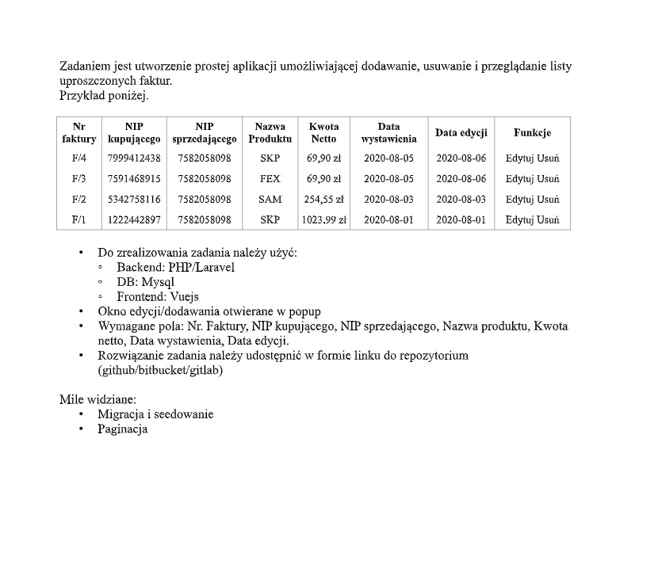

Zadaniem jest utworzenie prostej aplikacji umożliwiającej dodawanie, usuwanie i przeglądanie listy
uproszczonych faktur.
Przykład poniżej.
Nr
faktury
NIP
kupującego

NIP
sprzedającego
Nazwa
Produktu
Kwota
Netto

Data
wystawienia Data edycji Funkcje
F/4 7999412438 7582058098 SKP 69,90 zł 2020-08-05 2020-08-06 Edytuj Usuń
F/3 7591468915 7582058098 FEX 69,90 zł 2020-08-05 2020-08-06 Edytuj Usuń
F/2 5342758116 7582058098 SAM 254,55 zł 2020-08-03 2020-08-03 Edytuj Usuń
F/1 1222442897 7582058098 SKP 1023,99 zł 2020-08-01 2020-08-01 Edytuj Usuń
• Do zrealizowania zadania należy użyć:
◦ Backend: PHP/Laravel
◦ DB: Mysql
◦ Frontend: Vuejs
• Okno edycji/dodawania otwierane w popup
• Wymagane pola: Nr. Faktury, NIP kupującego, NIP sprzedającego, Nazwa produktu, Kwota
netto, Data wystawienia, Data edycji.
• Rozwiązanie zadania należy udostępnić w formie linku do repozytorium
(github/bitbucket/gitlab)
Mile widziane:
• Migracja i seedowanie
• Paginacja
